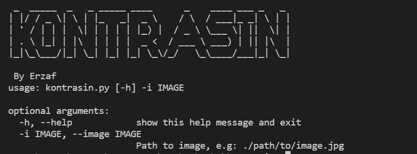
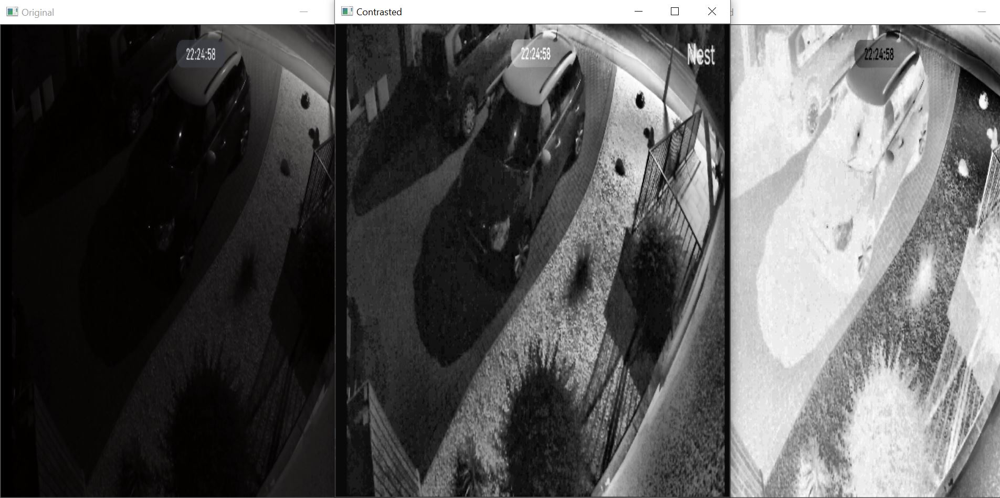

# KONTRASIN
OSINT Tool for Contrasting an Image in a Simple Way.

# Installation
```git clone https://github.com/erzaf/kontrasin.git```

Install the python required dependencies for this tool

```pip install -r requirements.txt```

# Usage
```python kontrasin.py -i image.jpg```

OR

```python kontrasin.py -i ./path/to/image.jpg```

# Example Result

